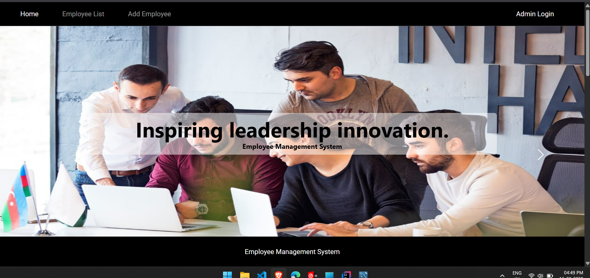
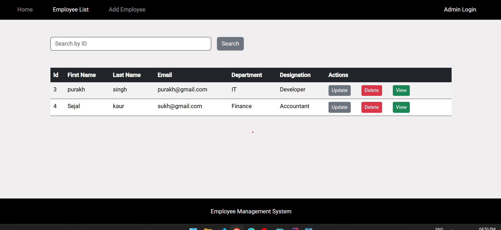
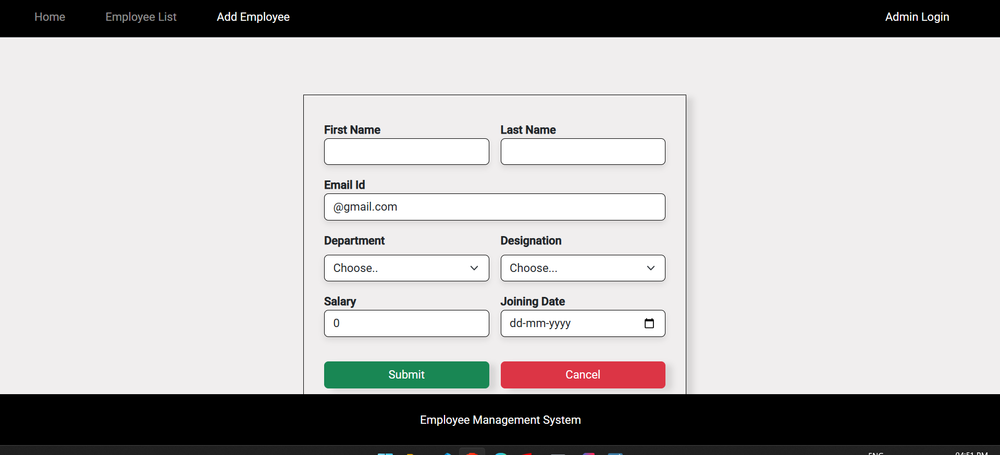

Full Stack Employee Management System – Angular, Spring Boot & MySQL

Employee Management System (EMS) is a full-stack web application developed to make employee data handling simpler and more optimized in an organization. It offers a methodical approach to adding, handling, and maintaining employee information via an interactive user interface and a robust backend.

Tech Stack:

Backend:

Spring Boot: A light, yet highly capable Java framework that drives the server-side logic and API layer. It provides scalability, modularity, and effortless integration with databases.

MySQL: Relational database management system employed to store and manage employee records securely with excellent data consistency.

Frontend:

Angular: Advanced client-side framework providing a responsive, component-based, and interactive user interface.

Features Overview :

(Home Page): Serves as the main entry point with fast access and uncluttered overview of system operations.

Employee Directory:

Produces an entire list of employees. Data can be searched, filtered, and sorted for easy access.

Add New Employee:

Features a form with validation rules to record new employee information correctly.

CRUD Operations

Execute basic operations like employee record creation, viewing, editing, and deletion.

Validation System

Maintains proper data entry so that records are consistent and free of errors.

⚙️ Backend :

Executes business logic, processes requests, and communicates with the database.

RESTful APIs designed with Spring Boot ensure seamless client-server communication.

Is optimized for maintainability and scalability to match organizational growth requirements.

Frontend:

Angular drives an uncluttered, modular interface with reusable components.

Two-way data binding enables real-time updates.

Responsive design makes it compatible on any device.

Conclusion:

The Employee Management System is an end-to-end solution for managing workforce information in an efficient way. Through the use of Spring Boot, Angular, and MySQL, the system offers a safe, efficient, and user-friendly interface that can grow with organizational needs.