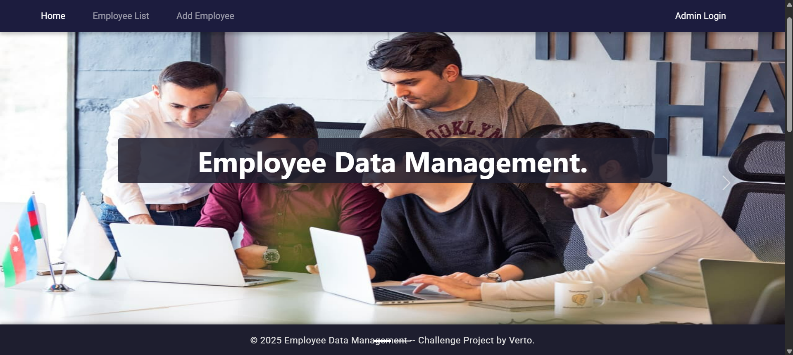
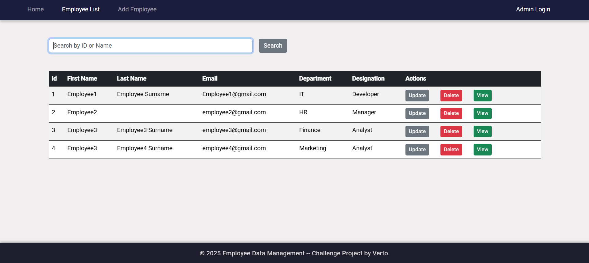
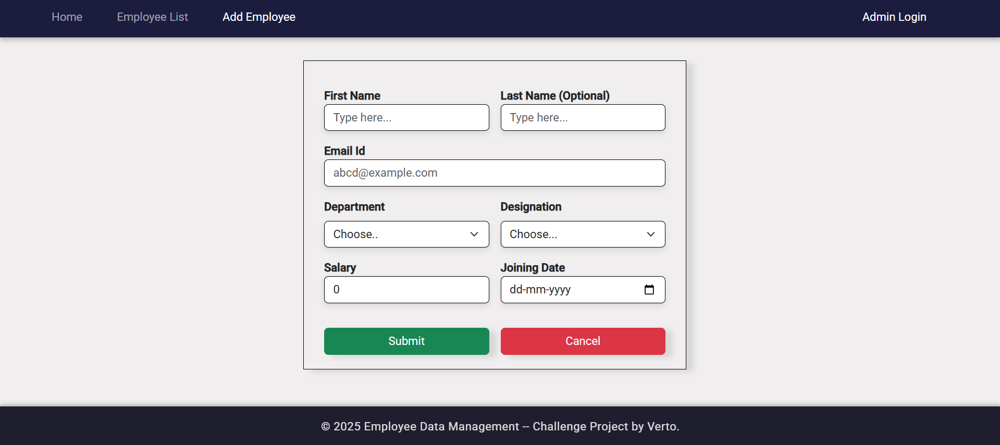
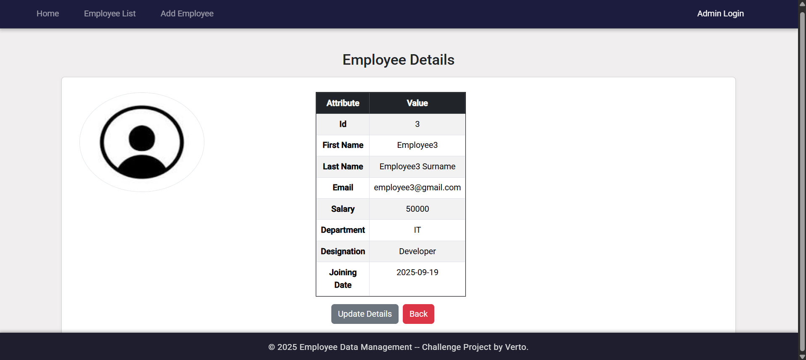
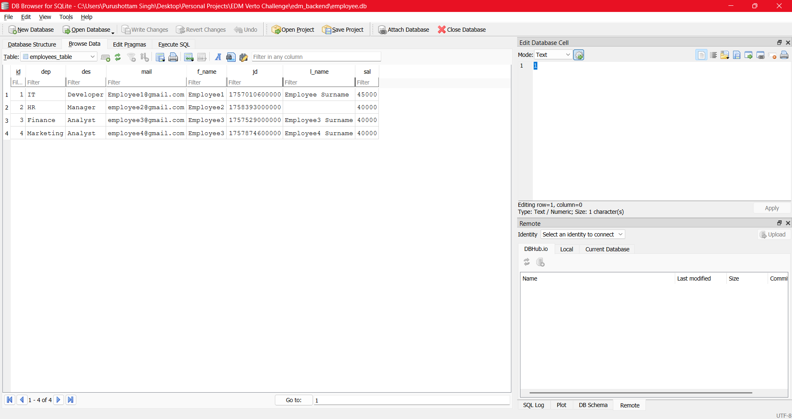

# Employee Management System

An Employee Management System built with **Spring Boot** (backend) and **Angular** (frontend).  
This project allows you to perform full CRUD operations (Create, Read, Update, Delete) on employees.

---

## 🚀 Core Features

- Add new employees
- View all employees
- View employee details
- Update employee information
- Delete employees
- SQLite database
- Search Employee by name and Id
- Form validation
- REST API backend with Angular frontend

---

## ⚙️ Setup Instructions

### 1. Clone the Repository

  - git clone https://github.com/purakh/Employee_Data_Management_Verto_Challenge-.git
  - cd employee-management-system


2. Backend Setup (Spring Boot)
   - cd edm_backend
   - mvn clean install
   - mvn spring-boot:run

Backend runs on: http://localhost:8080

3. Frontend Setup (Angular)
   - cd edm_frontend
   - npm install
   - ng serve

Frontend runs on: http://localhost:4200

🧪 Testing

I have used manual testing via **Postman** to verify the backend APIs and also included unit and integration tests for the `EmployeeController` using **JUnit 5** and **Mockito**.

Steps to Test the APIs:

1) Start the Backend
2) mvn spring-boot:run
3) The backend will run on: http://localhost:8080
4) Test with Postman
5) Open Postman and test the following endpoints:

| Method | Endpoint | Description |
|--------|----------|-------------|
| GET    | /api/v1/employees |      Fetch all employees |
| GET    | /api/v1/employees/{id} | Fetch an employee by ID |
| POST   | /api/v1/employees |      Add a new employee (send JSON body) |
| PUT    | /api/v1/employees/{id} | Update an existing employee (send JSON body) |
| DELETE | /api/v1/employees/{id} | Delete an employee |


- Verify Responses and ensure that:

- 200 OK responses are returned for successful GET, PUT, DELETE requests.
- 201 Created for successful POST requests.
- The response JSON matches the expected data.

**unit and integration tests** for the `EmployeeController` using **JUnit 5** and **Mockito**. The tests cover:

- Retrieving all employees (`testGetAllEmployees`)
- Retrieving a single employee by ID (`testGetEmployeeById`)
- Creating a new employee (`testCreateEmployee`)
- Updating an existing employee (`testUpdateEmployee`)
- Deleting an employee (`testDeleteEmployee`)

You can run the tests using Maven:

Terminal: mvn test


📝 Assumptions & Design Choices

- Database: Used SQLite for easy local development (file-based DB, no setup required).
- API Design: REST API under /api/v1/employees.
- CORS: Configured to allow requests from Angular frontend (http://localhost:4200).
- Simplification: No authentication/authorization implemented (assumed single-user application). Kept Authentication and admin login for future upgradtion.

UI Framework: Used Bootstrap for styling and layout.

📸 Screenshots
Frontend – Home Page


Employee list:


Add Employee:


Employee Profile view:


Database (DB Browser for SQLite):


```
📂 Project Structure
employee-management-system/
│
├── edm_backend/         # Spring Boot Backend
│   ├── src/main/java/com/example/demo/
│   ├── src/main/resources/application.properties
│   └── pom.xml
│
├── edm_frontend/        # Angular Frontend
│   ├── src/app/
│   ├── src/assets/
│   └── package.json
│
├── screenshots/         # Screenshots folder
│   
│
└── README.md```

👨‍💻 Author

Purushottam Singh
Email: purakhsingh108@gmail.com
GitHub: [purakh](https://github.com/purakh)
